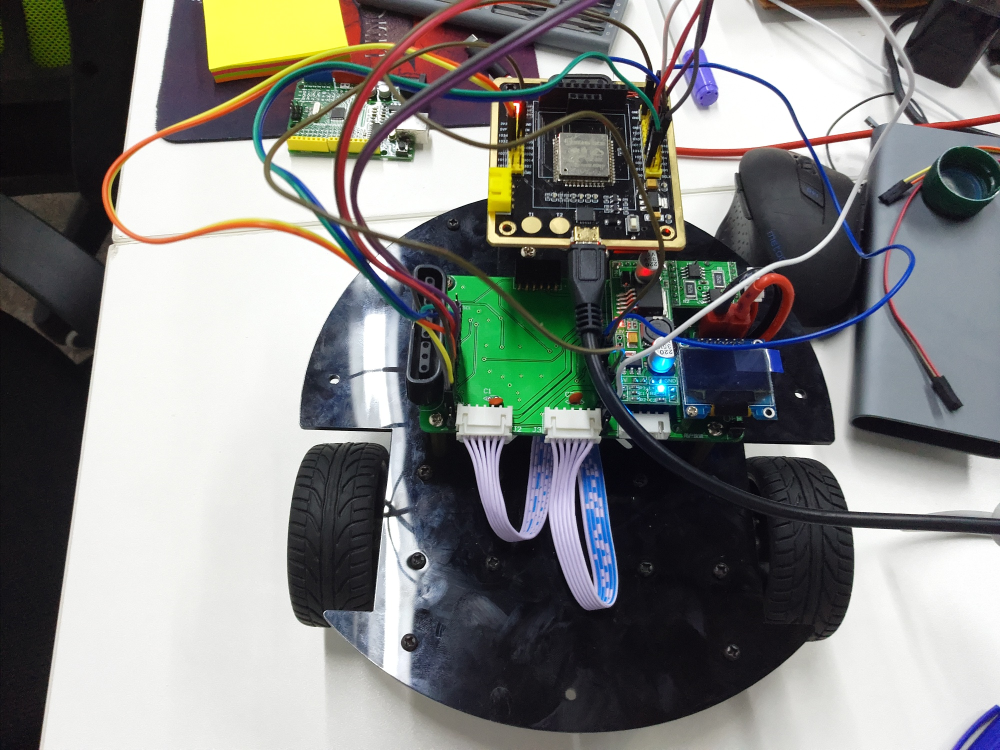

# esp32-wifi-car

小车由**1Z实验室出品** 

1ZLAB: Make Things Easy

## 项目简介

基于MicroPython-ESP32的WIFI小车, 小车硬件平台是标准两轮差速小车，小车底盘采用的是平衡小车之家的方案。在底盘上方放置了一个ESP32开发板，目前是通过杜邦线来链接。 ESP32的小车底板正在研发中。 

这款小车最后项目预期是可以使用Python二次开发，通过WIFI与PC进行远程控制。

可以比较精准的控制小车旋转的角度与速度。

## 贡献者(Ccontributor)

* 阿凯-1Z实验室
* 刘新宇-廊坊师范
