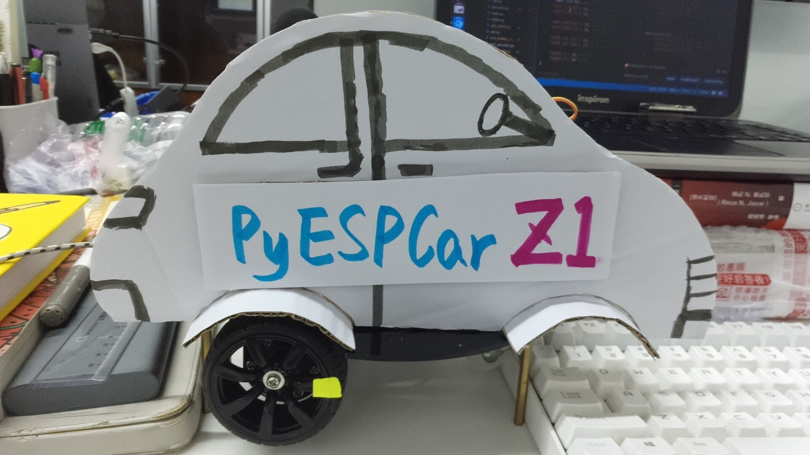
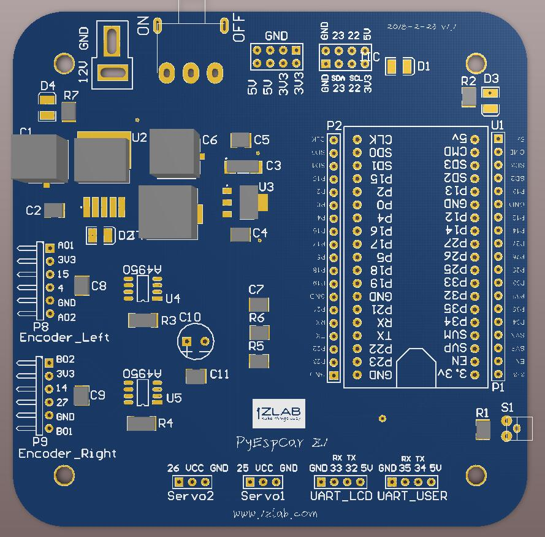

# PyEspCar-基于MicroPython-ESP32的WIFI小车

**1Z实验室出品**
1ZLAB： **Make Things Easy**

> 目前的小车型号： PyEspCar Z1

> 小车正在投产中，预计9月1号交付第一批PyEspCar Z1
>
> 购买小车联系 1Z实验室阿凯  QQ 244561792

## 项目简介

研发这个小车主要是为了1Z实验室之后出的OpenCV与机器人系列课程服务。另外由于Python的用户基数大，使用方便容易上手，所以1Z实验室基于MicroPython-ESP32开发了PyEspCar [开源地址 ](https://github.com/1zlab/1ZLAB_PyEspCar)标准两轮差速小车。

ESP32的小车底板正在研发中。 这款小车最后项目预期是可以使用Python二次开发，通过WIFI与PC进远程控制，可以通过PID控制小车旋转的角度与速度。

## 小车自身特性

* MicroPython编程， 使用**Python**控制小车，小车通过repl交互式编程。小车的上位机也用Python进行编写。

* **高精度小车转速与转角控制** 自带AB相编码器，采用四倍频技术，电机旋转一圈可以获取**1480个脉冲**。从而可以更精确的控制小车的旋转角度与转速。

* **远程调试**，通过WebREPL，可以远程给小车进行编程，修改PID参数，上传/同步代码文件。

* 软件硬件与机械结构全部**开源(Open Source)**。

  不用购买之后再提供，直接放在Github上，后续再配套教程持续制作用户友好的**文档**

* **配套教程**  制作PyEspCar Z1的视频教程（讲micropython-esp32与运动控制），发布在**Bilibili**上面， 内容可以参考下文的 `MicroPython-ESP32教学`与 `自控与运动学控制` 这两部分。

  B站主页： https://space.bilibili.com/40344504/#/

* **代码规范**，逐行注释，容易看懂， 参见代码仓库。

* 自主研发**ESP32 Web IDE**， 后续可以在1zlab.com 上面使用，开发中...

## 机械结构与硬件

* **自主设计轻量级二自由度云台**

  

  更适合放在小车上面，同时末端可以承受较大负载（例如手机）。

  高品质20KG 数字舵机， 后期可以拓展为机械臂。

* **自主设计ESP32小车底板** 

  

  填补了目前ESP32小车底板的空白，主控采用安信可公司的NodeMCU32s，直插在小车底板上。

  **板子预留资源**

  *  用户按键 ×1
  *  电机与AB相编码器接口 ×2
   *  舵机接口×2  : 控制舵机云台
   *  UART串口x2 
   *  I2C接口 x1（两个I2C插口）

  

* **全金属双层小车底板**  材质选用铝合金，比亚克力更坚固， 尺寸比一般的两轮差速小车大270mm。

  底板上面也预留了**数莓派**，二自由度云台，电池，超声波，ESP32小车控制板,还有**激光雷达**的孔位。

* **高精度小车编码器**  电机选用JBG37-520，减速比**1:30**, 电机力距大。 

  自带AB相编码器，采用四倍频技术，电机旋转一圈可以获取**1480个脉冲**。从而可以更精确的控制小车的旋转角度与转速。

* 12V电池组，电池容量3000毫安时， 配套充电器。

## MicroPython-ESP32教学计划
结合小车讲解单片机基础，用MicroPython来控制单片机。
学会如何控制小车的同时，也完成了单片机入门。另外，因为ESP32开发板自带蓝牙与WIFI，所以ESP32开发板也可以进行物联网IOT的开发。

| 组件         | 相关知识点                                                   |
| ------------ | ------------------------------------------------------------ |
| 电池采样     | ADC采样，Timer定时器轮巡，防止电池过放                       |
| 用户按键     | GPIO输入                                                     |
| 电机驱动     | GPIO输出，PWM，电机驱动的使用，Timer定时器                   |
| AB相编码器   | IRQ外部中断， AB相四倍频计数原理（电机旋转一圈1480个脉冲），位运算 |
| 二自由度云台 | PWM，Servo舵机控制， (如果小车搭载机械臂 -> I2C通信 舵机控制板的使用) |
| 串口液晶屏   | UART串口通信，给小车编写一个触屏的GUI界面（使用HMI串口液晶屏） |
| 加速度传感器 | I2C通信/UART                                                 |
| 蓝牙         | 蓝牙连接                                                     |
| WIFI         | WIFI连接， HTTP通信， Socket通信（TCP ， UDP）利用WIFI远程调参，远程上传代码 |

## 自控与运动学控制
使用Python（MicroPython-ESP32）结合实际项目（小车）讲解两轮差速小车的控制。

* PID控制电机旋转角度
* PID控制电机旋转速度
* 两轮差速小车运动学控制
* 小车旋转角度控制
* 小车整体速度控制
* PID控制舵机云台
* [TODO] 加速度传感器，惯性导航系统（可以与编码器进行信息融合）

**视频教学 + 调参上位机（可通过WIFI调参）**

## 综合项目教学

结合OpenCV计算机视觉完成特定的任务。
>有了小车的硬件平台， 后面拓展结合OpenCV项目就比较容易，后续的视频课程都围绕这个来做。

1. 小车色块追踪， 追着特定颜色的小球跑。
2. 小车巡线，讲解滤波算法 
3. 增强现实码ArucoTag追踪 
4. 。。。

## 贡献者(Ccontributor)

* [阿凯-1Z实验室](https://github.com/mushroom-x)
* [小峰-1Z实验室](https://github.com/rose-w)
* [小葱-1Z实验室](https://github.com/littleoniononion)
* [刘新宇-廊坊师范](https://github.com/LiuXinyu12378)
* [杨子豪-平衡小车之家](http://minibalance.com/)

## 加入1Z实验室

出品：1Z实验室 （1ZLAB： Make Things Easy）

1Z实验室 Make Things Easy . 致力于在机器人+计算机视觉+人工智能的重叠区域, 制作小白友好的教程.

