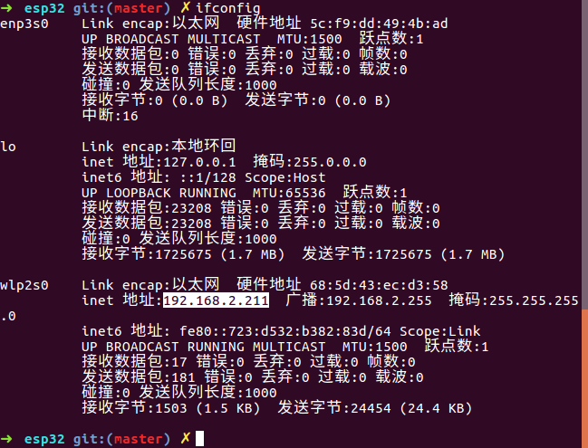
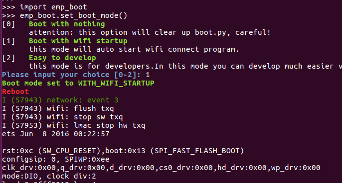
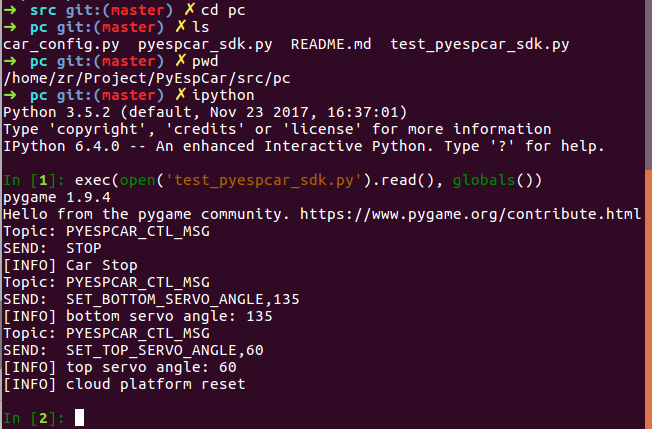

# PyESPCar开发环境配置


## 写在前面

我们的PyESPCar开发教程以及OpenCV图像处理部分的教程都是在Ubuntu下进行的, 因为Ubuntu下开发环境更加友好.  同时针对**VIP**用户, 我们还提供Ubuntu远程协助的服务.

Ubuntu是你步入开源世界的大门. 你可以选择在虚拟机下安装Ubuntu, 也可以选择在真机上安装Ubuntu.

在Ubuntu下,  我们的工程使用Python一统天下, Python完成嵌入式开发,机器人控制, Python进行图像处理, Python进行物联网通信. 所以你只需要精通这一门语言就足够了.


## Ubuntu下的开发环境配置

为了大家方便, 这里我还是把Ubuntu所需配置的环境在这里讲一下, 做一下汇总.


### Ubuntu虚拟机安装

如果你是用的Ubuntu虚拟机的话, 1Z实验室有虚拟机的安装教程:

[Ubuntu虚拟机安装-VirtualBox](https://github.com/1zlab/1ZLAB_OpenCV_Tutorial/blob/master/%E9%99%84%E5%BD%95A.OpenCV%E5%BC%80%E5%8F%91%E7%8E%AF%E5%A2%83%E9%85%8D%E7%BD%AE/Ubuntu/1.Ubuntu%E8%99%9A%E6%8B%9F%E6%9C%BA%E5%AE%89%E8%A3%85-VirtualBox/Ubuntu%E8%99%9A%E6%8B%9F%E6%9C%BA%E5%AE%89%E8%A3%85-VirtualBox.md)


### Git

git是工程版本管理工具, 你可以使用Git从Github克隆PyESPCar的开源工程.

在Ubuntu上安装git:

```bash
sudo apt-get install git
```


### Anaconda

Anaconda是Python的科学计算包. 

[在Ubuntu下安装Anaconda科学计算包](https://github.com/1zlab/1ZLAB_OpenCV_Tutorial/blob/master/%E9%99%84%E5%BD%95A.OpenCV%E5%BC%80%E5%8F%91%E7%8E%AF%E5%A2%83%E9%85%8D%E7%BD%AE/Ubuntu/2.Ubuntu%E5%AE%89%E8%A3%85Anaconda/%E5%9C%A8Ubuntu%E4%B8%8B%E5%AE%89%E8%A3%85Anaconda%E7%A7%91%E5%AD%A6%E8%AE%A1%E7%AE%97%E5%8C%85.md)


ipython, numpy等等, 这些包, 在安装Anaconda的时候, 也就一同安装好了.


### 安装OpenCV


图像处理方面需要安装**python-opencv**

使用anaconda安装opencv比较简单:

- [通过Anaconda安装OpenCV](https://github.com/1zlab/1ZLAB_OpenCV_Tutorial/blob/master/%E9%99%84%E5%BD%95A.OpenCV%E5%BC%80%E5%8F%91%E7%8E%AF%E5%A2%83%E9%85%8D%E7%BD%AE/Ubuntu/3.%E9%80%9A%E8%BF%87Anaconda%E5%AE%89%E8%A3%85OpenCV/%E9%80%9A%E8%BF%87Anaconda%E5%AE%89%E8%A3%85OpenCV.md)

更多OpenCV教程见 [1zlab.com](1zlab.com)

教程里面有从源码编译并安装OpenCV的教程, 但是不建议小白尝试. 但是对于数莓派用户来说, Anaconda是不可以用的, OpenCV也只能从源码编译.


### PyGame

PyGame是用于写游戏的.

因为我们用到了PyGame的键盘事件监听, 所以需要安装这个包.

```bash
sudo pip3 install pygame
```

### MicroPython-ESP32开发环境配置


PyESPCar是基于MicroPython-ESP32的, 所以MicroPython-ESP32的基本操作, 是需要你自己去学习的.

完整的教程见1Z实验室出品的: [MicroPython-ESP32从入门到差不多](https://github.com/1zlab/1ZLAB_MicroPython_ESP32_Tutorial)


下面的教程是你玩PyESPCar必须要看的.

- [MicroPython-ESP32固件烧录](https://github.com/1zlab/1ZLAB_MicroPython_ESP32_Tutorial/blob/master/01_MicroPython-ESP32%E5%9B%BA%E4%BB%B6%E7%83%A7%E5%BD%95/MicroPython-ESP32%E5%9B%BA%E4%BB%B6%E7%83%A7%E5%BD%95.md)
- [ESP32的REPL使用方法](https://github.com/1zlab/1ZLAB_MicroPython_ESP32_Tutorial/blob/master/02_ESP32%E7%9A%84REPL%E4%BD%BF%E7%94%A8%E6%96%B9%E6%B3%95/ESP32%E7%9A%84REPL%E4%BD%BF%E7%94%A8%E6%96%B9%E6%B3%95.md)
- [ESP32接入WIFI热点](https://github.com/1zlab/1ZLAB_MicroPython_ESP32_Tutorial/blob/master/17_ESP32%E6%8E%A5%E5%85%A5WIFI%E7%83%AD%E7%82%B9/ESP32%E6%8E%A5%E5%85%A5WIFI%E7%83%AD%E7%82%B9.md)
- [使用upip安装包](https://github.com/1zlab/1ZLAB_MicroPython_ESP32_Tutorial/blob/master/16_%E4%BD%BF%E7%94%A8upip%E5%AE%89%E8%A3%85%E5%8C%85/%E4%BD%BF%E7%94%A8upip%E5%AE%89%E8%A3%85%E5%8C%85.md)
- [WebREPL与MIcroIDE配置教程](https://github.com/1zlab/1ZLAB_MicroPython_ESP32_Tutorial/blob/master/14_WebREPL%E4%B8%8EMIcroIDE%E9%85%8D%E7%BD%AE%E6%95%99%E7%A8%8B/WebREPL%E4%B8%8EMIcroIDE%E9%85%8D%E7%BD%AE%E6%95%99%E7%A8%8B.md)
- [利用AMPY进行文件同步](https://github.com/1zlab/1ZLAB_MicroPython_ESP32_Tutorial/blob/master/18_%E5%88%A9%E7%94%A8AMPY%E8%BF%9B%E8%A1%8C%E6%96%87%E4%BB%B6%E5%90%8C%E6%AD%A5/%E5%88%A9%E7%94%A8AMPY%E8%BF%9B%E8%A1%8C%E6%96%87%E4%BB%B6%E5%90%8C%E6%AD%A5.md)
- [MQTT入门之概念解析](https://github.com/1zlab/1ZLAB_MicroPython_ESP32_Tutorial/blob/master/15_MQTT%E5%85%A5%E9%97%A8%E4%B9%8B%E6%A6%82%E5%BF%B5%E8%A7%A3%E6%9E%90/MQTT%E5%85%A5%E9%97%A8%E4%B9%8B%E6%A6%82%E5%BF%B5%E8%A7%A3%E6%9E%90.md)
- [MQTT入门之项目实战](https://github.com/1zlab/1ZLAB_MicroPython_ESP32_Tutorial/blob/master/19_MQTT%E5%85%A5%E9%97%A8%E4%B9%8B%E9%A1%B9%E7%9B%AE%E5%AE%9E%E6%88%98/MQTT%E5%85%A5%E9%97%A8%E4%B9%8B%E9%A1%B9%E7%9B%AE%E5%AE%9E%E6%88%98.md)


下方做了一下汇总:

一个是固件烧录, 你需要安装`esptool`

```bash
sudo pip3 install esptool --upgrade
```

详情见: [MicroPython-ESP32固件烧录](https://github.com/1zlab/1ZLAB_MicroPython_ESP32_Tutorial/blob/master/01_MicroPython-ESP32%E5%9B%BA%E4%BB%B6%E7%83%A7%E5%BD%95/MicroPython-ESP32%E5%9B%BA%E4%BB%B6%E7%83%A7%E5%BD%95.md)


通过REPL与MicroPython-ESP32交互, 你需要使用`picocom`

```bash
sudo apt-get install picocom
```

详情见: [ESP32的REPL使用方法](https://github.com/1zlab/1ZLAB_MicroPython_ESP32_Tutorial/blob/master/02_ESP32%E7%9A%84REPL%E4%BD%BF%E7%94%A8%E6%96%B9%E6%B3%95/ESP32%E7%9A%84REPL%E4%BD%BF%E7%94%A8%E6%96%B9%E6%B3%95.md)


通过AMPY进行文件同步, 需要安装AMPY

```bash
sudo pip install adafruit-ampy --upgrade
```

详情见: [利用AMPY进行文件同步](https://github.com/1zlab/1ZLAB_MicroPython_ESP32_Tutorial/blob/master/18_%E5%88%A9%E7%94%A8AMPY%E8%BF%9B%E8%A1%8C%E6%96%87%E4%BB%B6%E5%90%8C%E6%AD%A5/%E5%88%A9%E7%94%A8AMPY%E8%BF%9B%E8%A1%8C%E6%96%87%E4%BB%B6%E5%90%8C%E6%AD%A5.md)


MQTT相关的, 需要安装**mosquitto**

```bash
sudo apt-get install mosquitto mosquitto-clients 
```

详情见: [MQTT入门之项目实战](https://github.com/1zlab/1ZLAB_MicroPython_ESP32_Tutorial/blob/master/19_MQTT%E5%85%A5%E9%97%A8%E4%B9%8B%E9%A1%B9%E7%9B%AE%E5%AE%9E%E6%88%98/MQTT%E5%85%A5%E9%97%A8%E4%B9%8B%E9%A1%B9%E7%9B%AE%E5%AE%9E%E6%88%98.md)


## PyESPCar的工程文件介绍

PyESPCar的工程文件见:

[https://github.com/1zlab/1ZLAB_PyEspCar](https://github.com/1zlab/1ZLAB_PyEspCar)

使用git将这个文件夹clone克隆到本地文件夹.

> 对git不熟悉的同学, 需要自学一下git相关的操作.

```bash
git clone git@github.com:1zlab/1ZLAB_PyEspCar.git
```


这里主要讲一下工程里面源码的分布:

`src/esp32` 里面是micropython-esp32相关的代码.

`src/pc` 上面的代码是在PC上运行的.

```bash
➜  src git:(master) ✗ tree
.
├── esp32
│   ├── battery_voltage.py
│   ├── button.py
│   ├── car_config.py
│   ├── car.py
│   ├── cloud_platform.py
│   ├── led.py
│   ├── main.py
│   ├── motor.py
│   ├── mqtt_control_mode.py
│   ├── pca9685.py
│   ├── test_car.py
│   ├── test_motor.py
│   └── user_button.py
└── pc
    ├── car_config.py
    ├── pyespcar_sdk.py
    ├── README.md
    └── test_pyespcar_sdk.py

```


## 修改IP地址

需要修改`src/esp32/mqtt_control_mode.py` 的源码.

这里的`SERVER` 是我本机(Ubuntu)的IP地址.

```python
SERVER = '192.168.43.16'
CLIENT_ID = 'PYESPCAR_A0'
MQTT_TOPIC_ID = b'PYESPCAR_CTL_MSG'
```


如何查看PC在局域网的IP地址? 在bash里面输入:

```bash
ifconfig
```




其中的`inet 地址:192.168.2.211` 就是我们的本地地址.


## 上传代码到ESP32开发板

克隆下来之后`src` 文件夹下是所有的`PyESPCar`的源码. 其中`src/esp32` 文件夹下的文件是需要上传到ESP32开发板的. 

> 1Z实验室后续发货的开发板(带核心板)的版本已经帮大家上传好了所需的文件. 但是src/esp32/mqtt_control_mode.py 还是需要你自己再传一下.


那用什么方式传文件呢?  

1. 你可以选择使用1Z实验室的EMP IDE, 在Web上面把文件一个个传上去. 
2. 可以使用AMPY, 通过命令行的方式一个一个将文件传进去. 
3. 另外阿凯也写了一个批量上传的脚本, [update-all](https://github.com/1zlab/1ZLAB_PyEspCar/blob/master/tools/update_all.py) . 通过ampy上传当前目录下的所有文件.


## 关闭WebREPL模式

WebREPL模式会跟MQTT通信**资源抢占**, 导致网络不稳定.

 `main.py` 里面默认上电运行的是mqtt模式, 所以我们需要把webrepl模式关掉.

> 注: webrepl模式关掉, 也就意味着关掉后不能与EMP IDE进行连接.


设置boot启动模式为`1` **boot with wifi startup**

```python
>>> import emp_boot
>>> emp_boot.set_boot_mode()
```

填入数字`1`,  




完成配置.


## 阶段自我检查


在执行下一步之前, 确保你已经:

1. 通过picocom连接到ESP32开发板的REPL:  [ESP32的REPL使用方法](https://github.com/1zlab/1ZLAB_MicroPython_ESP32_Tutorial/blob/master/02_ESP32%E7%9A%84REPL%E4%BD%BF%E7%94%A8%E6%96%B9%E6%B3%95/ESP32%E7%9A%84REPL%E4%BD%BF%E7%94%A8%E6%96%B9%E6%B3%95.md)
2. 按照教程里面的说明, 连接上了WIFI热点: [ESP32接入WIFI热点 ](https://github.com/1zlab/1ZLAB_MicroPython_ESP32_Tutorial/blob/master/17_ESP32%E6%8E%A5%E5%85%A5WIFI%E7%83%AD%E7%82%B9/ESP32%E6%8E%A5%E5%85%A5WIFI%E7%83%AD%E7%82%B9.md), PC与ESP32连入同一个局域网.
3. 通过upip安装了`emp-1zlab`  与`umqtt.simple`  [使用upip安装包](https://github.com/1zlab/1ZLAB_MicroPython_ESP32_Tutorial/blob/master/16_%E4%BD%BF%E7%94%A8upip%E5%AE%89%E8%A3%85%E5%8C%85/%E4%BD%BF%E7%94%A8upip%E5%AE%89%E8%A3%85%E5%8C%85.md) ,  [MQTT入门之项目实战](https://github.com/1zlab/1ZLAB_MicroPython_ESP32_Tutorial/blob/master/19_MQTT%E5%85%A5%E9%97%A8%E4%B9%8B%E9%A1%B9%E7%9B%AE%E5%AE%9E%E6%88%98/MQTT%E5%85%A5%E9%97%A8%E4%B9%8B%E9%A1%B9%E7%9B%AE%E5%AE%9E%E6%88%98.md)
4. 将PyESPCar的工程文件, 传入到了ESP32的文件系统中.
5. 关闭esp32的webrepl模式
6. 按下开发板上的reset按钮, 重启后自动进入MQTT远程控制模式.


## 测试PyESPCarSDK

> 首先确保PyESPCar进入了MQTT模式, 成功连入局域网.

`src/pc` 下面是PyESPCar SDK 的源码还有简单的测试.


首先我们要进入到`src/pc` 所在的目录下.


然后执行`ipython` , 进入交互式命令行模式.

输入以下内容, 执行测试pyespcar sdk的测试程序.

```python
exec(open('test_pyespcar_sdk.py').read(), globals())
```





然后你就可以调用`sdk`的各种方法, 进行测试.

例如调用`turn_left` 方法, 让小车左转.

```python
>>> sdk.turn_left()
Topic: PYESPCAR_CTL_MSG
SEND:  TURN_LEFT,60
[INFO] car turn left, speed: 60, delay_ms: None

```

调用`turn_right`方法, 让小车右转.

```python
>>> sdk.turn_right()
Topic: PYESPCAR_CTL_MSG
SEND:  TURN_RIGHT,60
[INFO] car turn right, speed: 60, delay_ms: None

```

详情见`src/pc/pyespcar_sdk.py`


## 综合项目

`examples`下是目前所有的PyESPCar的样例代码.


[PyESPCar按键控制模式](https://github.com/1zlab/1ZLAB_PyEspCar/tree/master/examples/01-keyboards_ctl_mode)

[](https://github.com/1zlab/1ZLAB_PyEspCar/blob/master/examples/01-keyboards_ctl_mode/image/MQTT%E8%BF%9C%E7%A8%8B%E6%8E%A7%E5%88%B6.png)

[PyESPCar色块追踪](https://github.com/1zlab/1ZLAB_PyEspCar/tree/master/examples/02-color-block-track)

[](https://github.com/1zlab/1ZLAB_PyEspCar/blob/master/examples/02-color-block-track/image/%E5%B0%8F%E8%BD%A6%E8%89%B2%E5%9D%97%E8%BF%BD%E8%B8%AA.png) 


 [PyESPCar色块追踪小车-主题课程](http://www.1zlab.com/topic/opencv-color-track-car-pyespcar/)