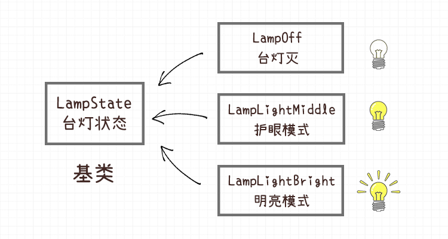
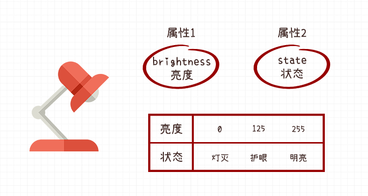

# Python有限状态机设计模式实现

## 概要
本文讲解了使用Python实现有限状态机, 并通过台灯这个样例, 真正理解有限状态机设计模式的使用方法.

**keywords** 台灯 FSM Python 设计模式 状态切换
## 状态的基类

我们还是以**台灯v2.0**的例子举例.


首先创建一个基类, 叫做`LampState`.

> 注: Lamp是台灯的英文 , State是状态.

```python
class LampState:
    name = 'state'
    allowed = []
    
    def switch(self, state):

        if state.name in self.allowed:
            print('[INFO] change state: {} to : {}'.format(self, state.name))
            self.__class__ = state
            return True
        else:
            print('[Error] could not change to state: {}'.format(state.name))
            return False            
    def __str__(self):
        return self.name
            
```


基类的`name`字段,  用于记录当前的状态的名字, 字符串形式.

另外, 在上节课,我们讲了有限状态机是有拓扑顺序的, 所以List `allowed` 就用于记录当前状态可以转入哪些的状态.


## 台灯的三种状态



上节课, 我们讲了台灯有三种状态:

1. `LampOff`  关闭台灯
2. `LampLightMiddle` 台灯护眼模式
3. `LampLightBright`  台灯明亮模式


我们分别创建三个类, 均继承自`LampState`

```python
class LampOff(LampState):
    name = 'LampOff'
    allowed = ['LampLightMiddle']

class LampLightMiddle(LampState):
    name = 'LampLightMiddle'
    allowed = ['LampLightBright']

class LampLightBright(LampState):
    name = 'LampLightBright'
    allowed = ['LampOff']
```


## 状态之间的切换

在当前的工程目录里面进入`ipython` 模式. 

从`lamp_state.py` 导入所有的状态类.


```python
>>> from lamp_state import *
```


创建一个初始状态(默认状态), 默认状态是关灯状态, 所以需要创建一个`LampOff`对象, **注意: 第一步必须实例化一个对象.**

```python
>>> lamp_state = LampOff()
```

打印一下当前的状态

```python
>>> print(lamp_state)
LampOff
```

好, 接下来测试一下状态转换, 调用`switch`函数, 传入的是下一个状态的**类 Class** , 这个很重要哦.

```python
>>> lamp_state.switch(LampLightMiddle)
[INFO] change state: LampOff to : LampLightMiddle
```

可以看到状态成功转换了诶. 打印一下看看, 发现原来的`LampOff` 对象, 眨眼间变成了`LampLightMiddle`对象.

```python
>>> lamp_state
<lamp_state.LampLightMiddle at 0x7f70859a6fd0>
```


核心就是`LampState` 基类`switch`方法里面的关键一句:

```python
self.__class__ = state
```

这句话,直接把当前的对象的类修改成了传入的`state`类, 在切换的同时, 原来的`name`, 与`allowed` 属性也一并修改了, 如下所示:

```python
>>> lamp_state.allowed
['LampLightBright']
>>> lamp_state.name
'LampLightMiddle'
```


接下来, 我们可以继续做状态转换:

```python
>>> lamp_state.switch(LampLightBright)
[INFO] change state: LampLightMiddle to : LampLightBright
```

此时的状态为`LampLightBright`. 

如果我们想让状态再返回到`LampLightMiddle` , 看看会发生什么事情:

```python
>>> lamp_state.switch(LampLightMiddle)
[Error] could not change to state: LampLightMiddle
```


啊噢, 报错了, 说你当前不能转换为`LampLightMiddle`状态

 不过这正是我们想要的, 在Python里面就是通过这种方式, 我们约束了状态与状态之间的转换.


## 创建一个台灯对象

有了状态的管理, 但是状态往往跟其本体是有一定的关联的, 例如**台灯状态**与**台灯** 之前是有关联的, 在台灯状态切换的时候, 往往也对应着台灯的一些动作, 需要做一定的响应.




`brightness` 属性用于记录`Lamp`对象的亮度, 切换状态的时候, 也对应着亮度的改变. `on_xxxx`  函数就是在进行状态变更的时候, 做的响应函数.


`lamp.py`

```python
from lamp_state import LampOff, LampLightMiddle, LampLightBright

class Lamp:
    '''台灯'''
    def __init__(self):
        # 当前的台灯亮度
        self.brightness = 0
        # 创建一个台灯实例
        self.state = LampOff()
        # 状态与台灯相应函数映射
        self.state_map = {
            LampOff: self.on_lamp_off,
            LampLightMiddle: self.on_lamp_light_middle,
            LampLightBright: self.on_lamp_light_bright
        }

    def set_brightness(self, value):
        '''设置台灯亮度'''
        self.brightness = value
        print('[INFO]set brightness to {}'.format(value))

    def on_lamp_off(self):
        '''响应关灯状态'''
        print('[INFO] on lamp off')
        self.set_brightness(0)

    def on_lamp_light_middle(self):
        '''响应台灯护眼模式'''
        print('[INFO] on lamp light middle')
        self.set_brightness(125)
    
    def on_lamp_light_bright(self):
        '''响应台灯明亮模式'''
        print('[INFO] on lamp light bright')
        self.set_brightness(255)
    
    def switch(self, state):
        '''切换状态'''
        result = self.state.switch(state)
        if result:
            # 成功进行状态转换
            # 执行状态转换的函数
            self.state_map[state]()
        else:
            print('[ERROR] Fail to change  state to {}'.format(state))

```


## 测试台灯对象

重新进入`ipython`

导入所有的状态以及Lamp对象

```python
>>> from lamp_state import *
>>> from lamp import Lamp
```

创建一个`Lamp` 对象, 打印一下当前的`state`

```
>>> lamp = Lamp()
>>> lamp.state
<lamp_state.LampOff at 0x7f410401b048>
```

切换状态为护眼模式

```python
>>> lamp.switch(LampLightMiddle)
[INFO] change state: LampOff to : LampLightMiddle
[INFO] on lamp light middle
[INFO]set brightness to 125
```

切换状态为明亮模式

```python
>>> lamp.switch(LampLightBright)
[INFO] change state: LampLightMiddle to : LampLightBright
[INFO] on lamp light bright
[INFO]set brightness to 255
```

关闭台灯

```python
>>> lamp.switch(LampOff)
[INFO] change state: LampLightBright to : LampOff
[INFO] on lamp off
[INFO]set brightness to 0
```


## 作业

作业提交方式, 把你的作业发送给阿凯, 邮箱为`xingshunkai@qq.com`
附件名修改为: `姓名_PythonFSM_Lamp.zip` 阿凯会给你进行作业批改.

###  作业1-添加按键
我们这个`lamp`其实模拟的还不够完善, 用户交互界面其实应该只有一个按钮, 每次按按钮, 然后完成状态的切换.
那你的任务就是给这个`Lamp` 类添加一个`button_press` 函数, 模拟按键按下, 每次执行`lamp.button_press()` 就进行一次状态切换.

###  作业2-在MicroPython上实现台灯
用今天所学的FSM设计模式的Python实现, 重构上一次课的MicroPython-ESP32台灯作业, 把这份模拟的代码在MicroPython-ESP32上面实现.
相信你可以做的更好.


### 作业3-分析FSM设计模式优缺点

**尝试分析FSM设计模式的优缺点**

使用数字记录状态不是挺简单的么? 为什么要创建这么多的对象, 写着么多代码?

什么时候用FSM设计模式会比较有优势? 

以上问题,不期待你可以马上给出答案, 在接下来的学习之中, 希望你可以把这个问题放在心里, 不断的思考, 并通过项目实战用心体会.