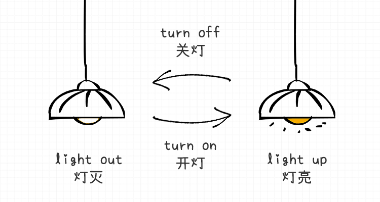
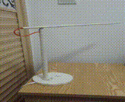
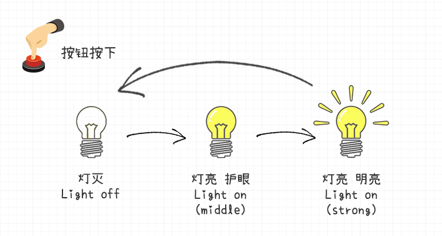

# 有限状态机简介

## 概要

有限状态机是整个色块追踪小车最核心的代码, 我将用三节课的时间,从台灯讲到Python有限状态机的设计模式, 然后讲到我们这个PyESPCar色块追踪小车的状态转换与Python实现.

**keywords**   FSM 有限状态机 台灯 状态转换

## 台灯1.0

有限状态机的英文是**Finite State Machine** , 英文简称是**FSM**, 是非常常用的一种设计模式**Design Pattern** .

听到这个名字,可能你会觉得这是什么了不起的新概念, 其实并没有, 我们的日常生活中会经常用到这个这个概念.

首先何为**状态 State** ?  举个例子, 我们的台灯, 有两种状态**LightUp 灯亮** 与**LightOff 灯灭**. 

> 注: 灯灭与灯亮状态转换图

**灯亮状态** 与 **灯灭状态** 之间可以相互转换, 用一个**箭头 Arrow** 来标识状态之间切换的动作/或者判别条件, 箭头上添加注释.  

用户打开开关, 对应**开灯 Turn On**的动作, 状态从灯灭状态转换为了灯亮的状态. 

用户关闭开关, 对应**关灯 Turn Off** 的动作, 状态从灯亮状态转换为了灯灭的状态.

像这种**有限Finite**个**状态State**的**机器Machine** , 就叫做有限状态机, 机器不一定是个实体, 可能是一个系统. 

## 台灯2.0

相信大家手里的台灯还有另外一种样子的, 还有一个护眼模式.

1. 按一下按键(触摸或者是实体按键), 从灯灭进入护眼模式

2. 再按一下按键, 台灯进入明亮模式

3. 再按一下按键, 台灯关闭

就这样往复循环, 如下图所示:

> 注: 护眼模式台灯 gif

> 注: 灯灭->护眼模式-> 明亮

之所以举这个例子呢, 是想说状态与状态之间的转换其实,是有约束的.

**状态转换**是有**拓扑顺序**的, 所谓拓扑顺序就是说,先怎么样,然后才能怎么样.

先从灭灯状态进入护眼模式, 接下来才能进入明亮模式. 不能从灭灯一步到位进入明亮模式. 这个也是**FSM** 非常重要的属性之一, 学过**数据结构DataStucture** 的同学,可能会知道, 这个图其实是**有向图 directed graph**. 

另外一个属性就是,FSM有一个**默认状态**, 在**台灯2.0** 里面默认状态就是**Light Off 灯灭**, 系统开启的时候,先进入**Light Off** 然后再进入其他的状态.

## 作业

作业提交方式, 把你的作业发送给阿凯, 邮箱为`xingshunkai@qq.com`
附件名修改为: `姓名_MicroPython_Lamp_V1.zip` 阿凯会给你进行作业批改.

作业提交格式说明 源码+演示视频
## 作业1
用有限状态机的设计思想,设计一个ESP32小台灯, 实现台灯2.0之间的转换.

**提示Hint** 你可以使用一个**整数类型的全局变量 state** 来记录当前的状态, 检测按键按下, state就发生变化, 每一个state都代表一个状态. ESP32根据state作出不同的相映.

## 课程预告

下节课, 阿凯教大家如何使用Python实现状态设计模式, 届时你再来重构你的代码.
