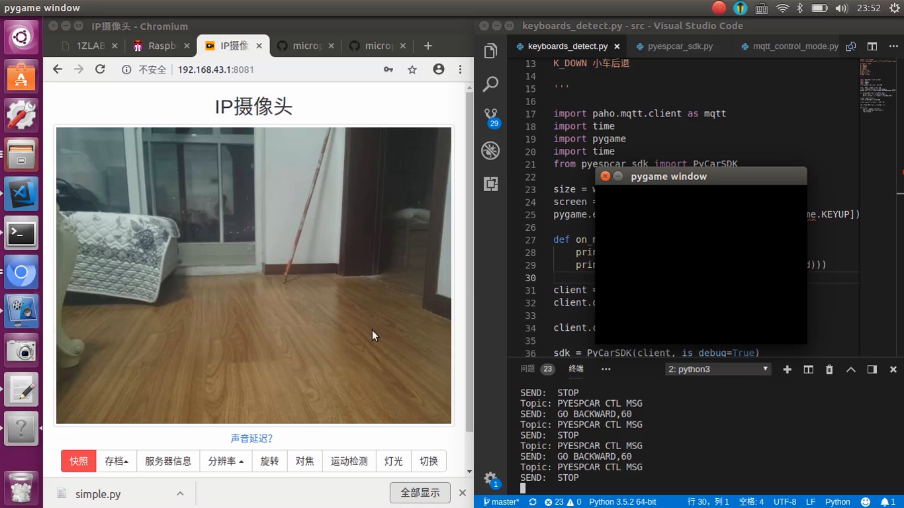

# PyESPCar按键控制模式


使用PyGame做键盘事件监听，然后映射到`pyespcar sdk`的方法上面。

运行程序：

```bash
sudo python3 keyboards_ctl_mode.py
```


注意要选中当前的PyGame的窗口

**键盘与功能映射**

| 按键      | PyGame中的按键标识 | 功能描述     |
| --------- | ------------------ | ------------ |
| 空格键    | K_SPACE            | 小车停止     |
| 字母键-W  | K_w                | 云台向上旋转 |
| 字母键-A  | K_a                | 云台向左旋转 |
| 字母键-S  | K_s                | 云台向下旋转 |
| 字母键-D  | K_d                | 云台向右旋转 |
| 方向键-左 | K_LEFT             | 小车向左转   |
| 方向键-右 | K_RIGHT            | 小车向右转   |
| 方向键-上 | K_UP               | 小车前进     |
| 方向键-下 | K_DOWN             | 小车后退     |


同时你也可以将手机挂载到小车上，打开IP摄像头APP，感受实时图传的体验， 效果视频见：



`./video/PyESPCar键盘控制+手机WIFI图传.mkv`


APP的使用教程见：

[IP摄像头APP与OpenCV视频流读取-1Z实验室](https://www.jianshu.com/p/0586d7dad113)

