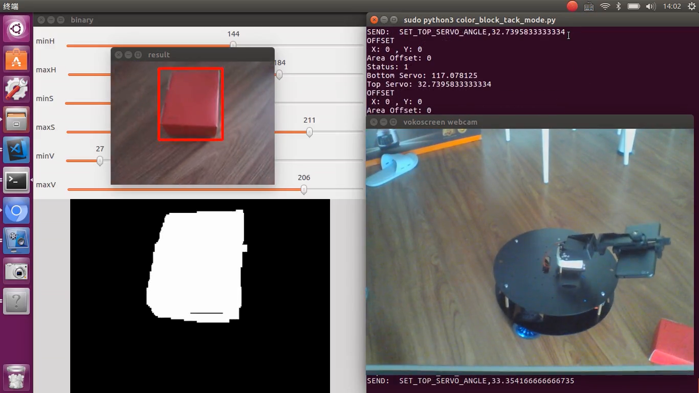

# PyESPCar色块追踪


## 效果演示




效果视频见：`./video/PyESPCar色块追踪效果V1-20181002.mkv`


> 更新效果演示（新版本的代码）


## 1.打开PyESPCar

打开PyESPCar， 默认上电执行MQTT模式的代码，把色块放在手机摄像头的可视区域内。

同时开启IPCamera的APP。


## 2.色块识别节点 ColorBlockFinder


识别色块，并且将色块举例画面的偏移量，以及面积的偏移量，通过MQTT发送给**物体追踪节点**。

```bash
python3 color_block_finder_node.py
```

刚开始执行程序的时候, 需要截取当前画面中的色块部分（**SelectROI**）, 选中后回车表示确认。


接下来，使用**直方图反向投影** 进行色块识别，不需要手动调节阈值


## 3.物体追踪节点 ObjectTracker

在另外一个终端， 运行下面的指令：

```bash
python3 object_tracker_node.py
```

该节点，会接收来自**色块识别节点ColorBlockFinder** 的偏移量信息，进而计算得到PyESPCar的控制指令，并通过MQTT发送给PyESPCar。


在这个代码里面，我们用到了 **有限状态机 Finite State Machine。 **， 并通过Python的状态(State)设计模式实现该算法。


教程制作出来需要一段时间，大家可以先扫码加群，课程会在群里发布。

