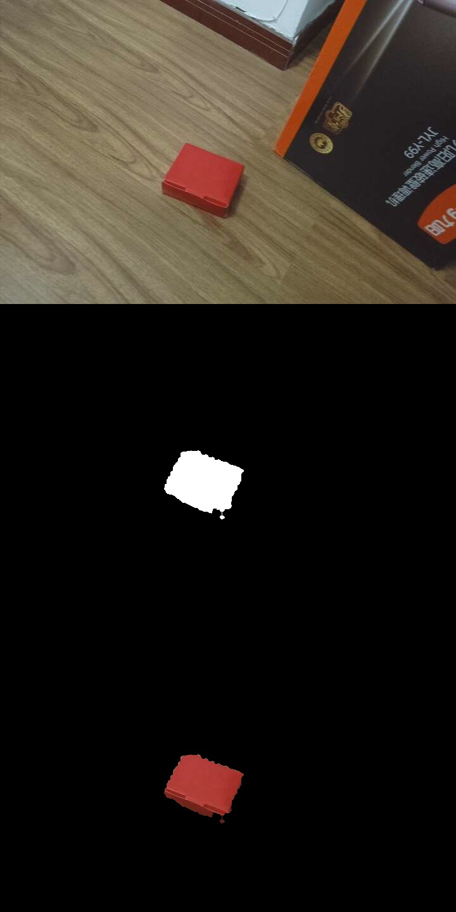

# PyESPCar色块追踪使用说明


## 工程文件说明


| 文件                       | 备注                                               |
| -------------------------- | -------------------------------------------------- |
| car_config.py              | 小车的配置文件                                     |
| pyespcar_sdk.py            | PyESPCar的SDK                                      |
| pid.py                     | PID控制的库                                        |
| wifi_camera.py             | IP摄像头的类                                       |
| car_state.py               | 定义了小车的各种状态                               |
| object_tracker.py          | 物体追踪类                                         |
| cvutils.py                 | 自定义了一些CV小工具                               |
| color_block_finder_node.py | 色块识别的节点, 发送识别出的色块信息给物体追踪节点 |
| object_tracker_node.py     | 物体追踪节点, 发送控制指令给PyESPCar               |


## 开发配置


### IP摄像头

这里我们使用了一个名字叫做IP摄像头APP,把手机作为了WIFI摄像头. 使用教程见:

[IP摄像头APP与OpenCV视频流读取-1Z实验室](https://www.jianshu.com/p/0586d7dad113)


### 配置色块识别节点

这里你需要修改一下这个Phone的IP, 从上面的APP画面中获得.

```python
# 创建一个IP摄像头对象
phone_ip = '192.168.43.1'
```


## 操作流程

### 1.打开PyESPCar

打开PyESPCar， 默认上电执行MQTT模式的代码，把色块放在手机摄像头的可视区域内。

同时开启IPCamera的APP。


### 2.色块识别节点 ColorBlockFinder


识别色块，并且将色块举例画面的偏移量，以及面积的偏移量，通过MQTT发送给**物体追踪节点**。

```bash
python3 color_block_finder_node.py
```

刚开始执行程序的时候, 需要截取当前画面中的色块部分（**SelectROI**）, 选中后回车表示确认。


接下来，使用**直方图反向投影** 进行色块识别，不需要手动调节阈值





### 3.物体追踪节点 ObjectTracker

在另外一个终端， 运行下面的指令：

```bash
python3 object_tracker_node.py
```

该节点，会接收来自**色块识别节点ColorBlockFinder** 的偏移量信息，进而计算得到PyESPCar的控制指令，并通过MQTT发送给PyESPCar。


在这个代码里面，我们用到了 **有限状态机 Finite State Machine。 **， 并通过Python的状态(State)设计模式实现该算法。