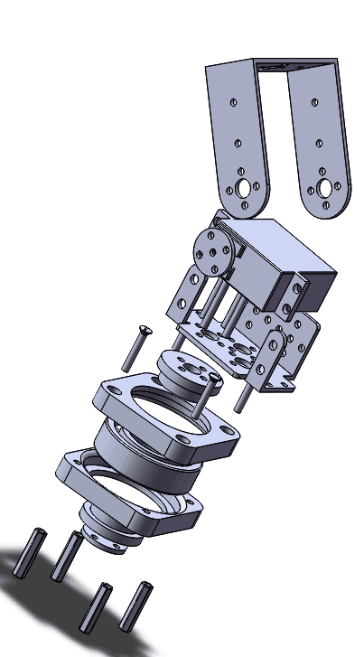

# PyESPCar配件清单+物料成本核算-V2

## 备注

1. 物料核算包括物流消耗，不包括整车发货的快递费
2. 物料成本随着工艺选择与物料供应商以及生产规模会有所调整，物料成本的调整记录见版本说明。

## 价格汇总

| 编号 | 套装                            | 成本汇总 |
| ---- | ------------------------------- | -------- |
| 1    | 小车主控(ESP32开发板与电机驱动) | 124      |
| 2    | 小车底板                        | 285.5    |
| 3    | 舵机云台+手机支架               | 164.8    |
| 4    | 全套(套餐1-3)                   | 574.3    |

## PART1-小车主控

| 物料名称          | 费用 | 备注                                                         |
| ----------------- | ---- | ------------------------------------------------------------ |
| ESP32开发板       | 39   | 安信可 NodeMCU 32s                                           |
| ESP32小车驱动底板 | 85   | PyESPCar Z1（黑色PCB，进口TI芯片，机器贴片），后期批量做成本会下降 |

金额合计： 124

##  PART2-小车底板

| 物料名称                | 费用 | 备注                                               |
| ----------------------- | ---- | -------------------------------------------------- |
| 小车底盘                | 75   | 铝合金底盘上下双层，氧化工艺，黑色（70+5）         |
| 电机套装（带编码器） x2 | 100  | 型号JGB37-520 直流减速电机 带AB相测速.             |
| 万向轮 + 牛角轮         | 7    | 万向轮与牛角轮二选1（发货两种都提供， 一个是3.5）  |
| 铜柱，螺丝              | 15   | 杂七杂八的配套螺丝 （13.5 + 1.5）                  |
| 电池                    | 70   | 12v 6000毫安时 锂电池（带电池充电器，定制T形插头） |
| 小车包装成本            | 20   | EPE珍珠棉包装材料，瓦楞纸2号箱，各种配件的包装袋   |

金额合计： 285.5

## PART3-舵机云台+手机支架

> 注： 舵机云台用于挂载手机，WIFI传图，结合OpenCV计算机视觉做项目。
>
> 然后PC给小车发送控制信号。

| 物料名称                 | 费用 | 备注                                  |
| ------------------------ | ---- | ------------------------------------- |
| 二自由度云台3D打印结构件 | 20   | 高精度树脂 添加物流费（18 + 2）                  |
| 二自由度云台轴承         | 3.3  | 包邮                                  |
| 二自由度云台金属支架     | 8    |                                       |
| 舵盘                     | 2    | 已加物流费（1.2 + 0.8）               |
| 舵机                     | 103  | 20K扭矩 金属数字舵机  180度 + 270度   |
| 金属热靴                 | 3.5  | 挂载手机支架用（加上平均运费 2+ 1.5） |
| 手机支架                 | 25   |                               |

金额合计： 164.8

## 版本说明

**成本v2**

1. 将原有的一整套拆分为三个模块 1. 小车主控 + 2. 小车底板 +  3. 舵机云台+手机支架
2. 增加了手机支架与热靴，用于固定手机，
3. 添加了部分配件的物流成本（以10件为标准，物流费平均）
4. 小车底板工艺由原来的手工焊接改为了机器贴片。

更新时间： 2018-08-31

